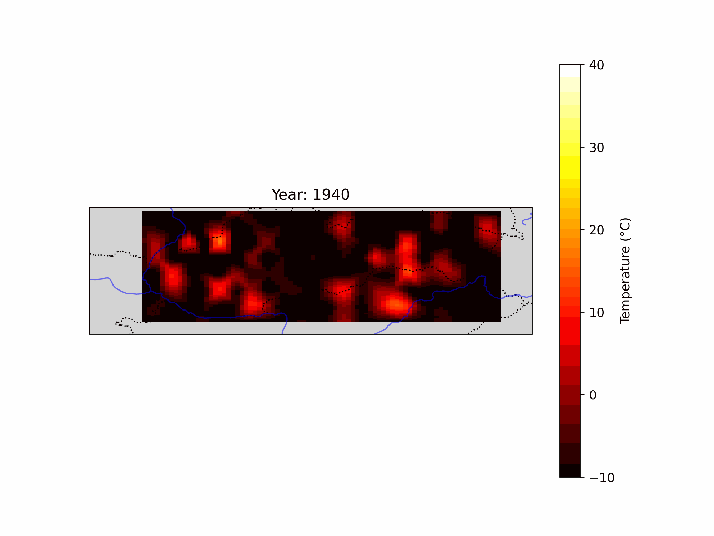
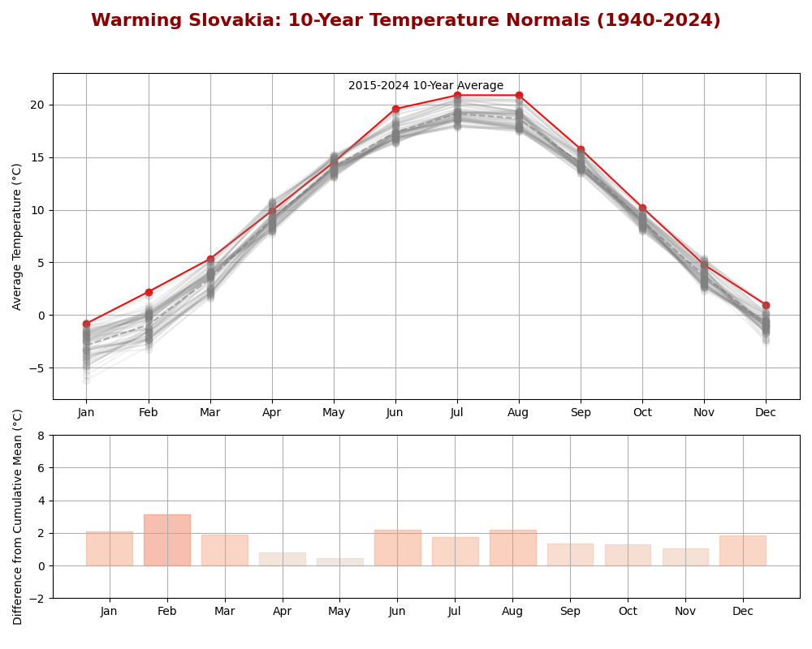

# Climate-Change-Slovakia

**An 80-Year Analysis of Air Temperature Changes in Slovakia**

## About

This repository contains an analysis of air temperature trends in Slovakia from 1940 to 2023, highlighting how monthly average temperatures have shifted over time. The analysis, visualized through an animated GIF, reveals key trends in Slovakia’s temperature history and offers insights into climate change's impact on this region.

Two Python scripts are included:
- **Data Download Script**: Downloads monthly air temperature data for Slovakia from the Copernicus Climate Change Service (C3S).
- **Analysis and Visualization Script**: Processes and visualizes the data as an animated GIF showing n-year moving averages.

The GIF reveals a clear upward trend in temperatures, with a notable finding: the months of May, and to a lesser extent April, show a smaller increase in temperature compared to other months.

## Repository Structure

- `src/`: Contains the two primary Python scripts:
  - `data_download.py`: Script to download historical air temperature data from C3S.
  - `analysis_visualization.py`: Script to process and visualize the data, generating the final animated GIF.
- `results/`: Contains the output of the analysis, including the animated GIF.
- `README.md`: The main document explaining the project, methodology, and interpretation of results.

## Methodology

### Data Collection

The data was obtained from the **Copernicus Climate Change Service (C3S)**, which provides reliable and standardized climate data. The `data_download.py` script downloads monthly air temperature data from 1940 to 2024, focusing on the region of Slovakia.

### Analysis Process

The analysis includes the following steps:
1. **Data Processing**: The monthly temperature data is smoothed using a 10-year moving average to show trends over each decade. For example, the first average is calculated for 1940-1949, then for 1941-1950, and so forth.
2. **Visualization**: The processed data is visualized in an animated GIF, which depicts the average temperature for each month over each 10-year period. This approach provides an intuitive look at temperature trends over time and highlights significant shifts.

The `analysis_visualization.py` script generates this animated visualization, stored in the `results` folder as `temperature_trend.gif`.

## Key Findings

The analysis yields several notable insights:
- **Temperature Increase**: Obviously, there is a clear upward trend in air temperatures in Slovakia over the 80-year period. The animation below shows by how much the temperature increased in each month.
- **Uneven Warming**: Months of May, and partially April, exhibit significantly smaller increases in temperature compared to other months, suggesting potential seasonal nuances in warming patterns. For detailed view, see the static image below, where the final iteration of the animation is shown with the 10-years temperature averages for 2014-2023. 

## Installation and Usage

1. **Clone the Repository**:
    ```bash
    git clone https://github.com/SimonDataLab/Climate-Change-Slovakia.git
    cd Climate-Change-Slovakia
    ```

2. **Install Dependencies**:
   Ensure you have Python and necessary packages installed. You can use the following command to install packages:
    ```bash
    pip install -r requirements.txt
    ```

3. **Run the Data Download Script**:
   This script will download the necessary historical data. Ensure you have access credentials for the Copernicus Climate Change Service.
    ```bash
    python src/data_download.py
    ```

4. **Run the Analysis and Visualization Script**:
   This will process the downloaded data and generate the animated GIF in the `results/` folder.
    ```bash
    python src/analysis_visualization.py
    ```

## Interpreting the Results

The animated GIF (`temperature_trend.gif`) visualizes 10-year moving averages of monthly temperatures. It provides an overview of temperature trends and offers a month-by-month look at how warming has impacted different times of the year. The smaller increase in May (and partly April) temperatures could suggest a seasonal discrepancy in climate change effects, potentially influenced by local environmental or atmospheric factors.

### Example Output

Below is an example of the generated visualization:



The animation demonstrates how temperatures' 10-year moving averages have moved over time, with the red curve representing specific 10 year period and grey representing past periods.

Below is the final iteration (2014-2023) from previous animation showing by how much the temperature increased in each month compared to cummulative average:




## Acknowledgments

This project utilizes data from the **Copernicus Climate Change Service (C3S)**. Part of the code was generated with assistance from ChatGPT to streamline data processing and visualization.

## Disclaimer

This analysis was generated using information from the Copernicus Climate Change Service (C3S). The European Commission and the European Centre for Medium-Range Weather Forecasts (ECMWF) are not responsible for any use that may be made of the information it contains. The contents of this analysis are solely the responsibility of the author(s) and do not necessarily reflect the views of the European Commission or ECMWF.


## License

This project is licensed under the MIT License. Please see `LICENSE` for more information.
